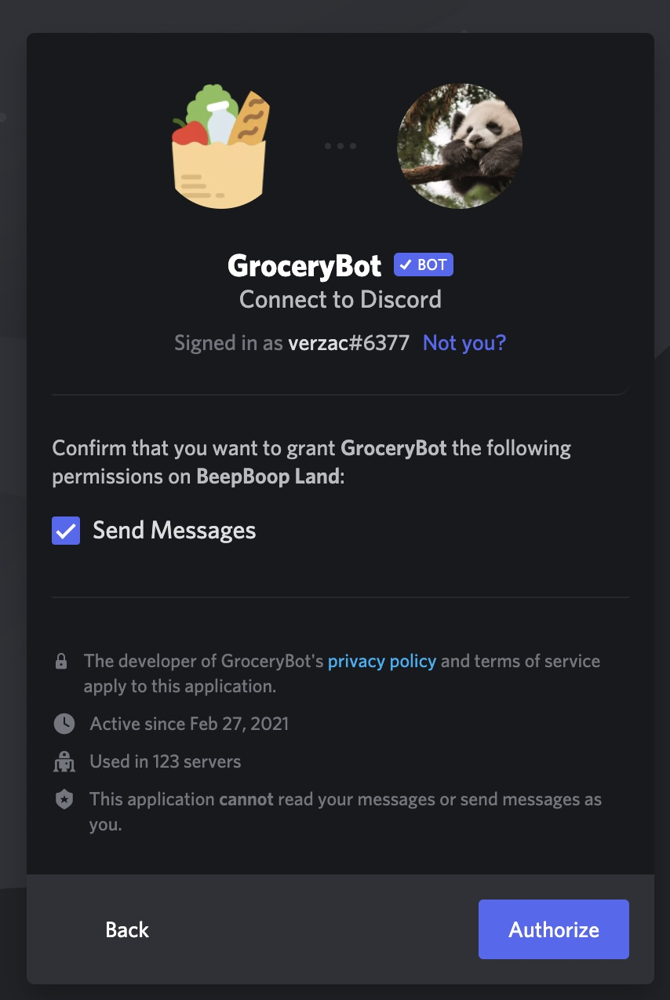
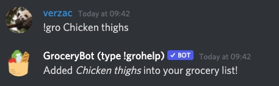
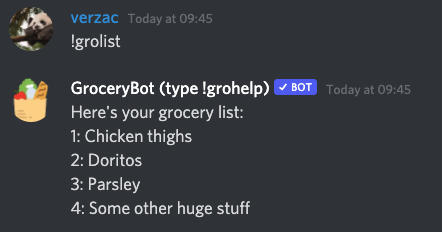
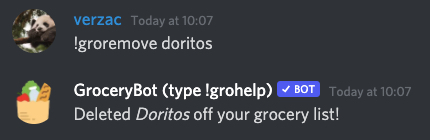
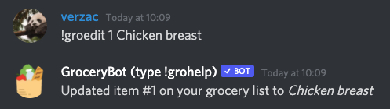
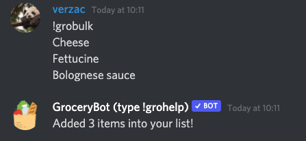
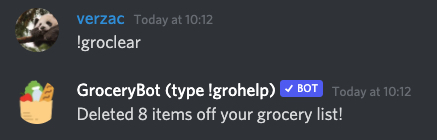

# Getting Started with GroceryBot

Get a grocery list going for your Discord server! No more switching apps just to have a look at your grocery list.

:::info

## Slash Commands Are Now Out!

Use slash commands as the primary way to interact with GroceryBot (for example, `/gro`, `/grolist`, and `/grobulk`).

Legacy `!gro` message commands are still available in this page: [Legacy Message Commands](./legacy/message-commands.md).

When using the legacy format, mention `@GroceryBot` before your command; otherwise GroceryBot won't receive your command. For example:


:::

## Getting started

To get started with GroceryBot, all you have to do is add the bot to your server through the link below:

**[Invite GroceryBot](https://discord.com/oauth2/authorize?client_id=815120759680532510&permissions=2048&scope=bot%20applications.commands)**

...and, that's it!

_Note: GroceryBot requires the "Send Message" permission to function properly. Please make sure that it is enabled._

<!--  -->


## /gro - Add your first grocery entry 📝

<!-- Picture this: you're currently in a Discord convo with your housemates. You're deciding on what to eat, and suddenly, an eureka hits you: a pasta dish would be amazing! You have to buy the ingredients first though. There are now 2 scenarios: you pull out your phone, fiddle around with a grocery list app, switch between that app and Discord multiple times as you telegraph what your housemates want on your pasta to your app; or...

...you just use GroceryBot and tell your housemates to add their desired ingredients themselves. Oh, and don't forget the snacks! -->

Once you add GroceryBot, you can immediately start adding grocery entries:

```
/gro entry:Chicken thighs
```



You can also target a specific custom list:

```
/gro entry:Chicken thighs list-label:amazon
```

## /grolist - Display/view your grocery list 👓

Alright, so everyone's added their preferred pasta topping and some sides as well - great!

To bring up your current grocery list:

```
/grolist
```

```
Here's what you have for your grocery list:
1. Chicken thighs
2. Doritos
3. Parsley
4. Some other huge stuff
```



To show all grocery lists in your server in one response, set the `all` option:

```
/grolist all:yes
```

## /grohere - Attach a self-updating grocery list to a channel 📲

Attach a self-updating message for your grocery list:

```
/grohere
```


As you update your grocery list, GroceryBot updates this attached message, so you don't have to keep typing `/grolist` all the time.

_Protip: attach it to a dedicated channel so you can quickly switch over and check your latest list._

To attach a view of all grocery lists in the server, set the `all` option:

```
/grohere all:yes
```

## /groremove - Remove grocery entries 🧹

Okay, okay - Kyle probably didn't need you to buy Doritos as well; you're just a lone shopper, after all! You can't buy everything for the house yourself.

You can remove by entry index or by entry name:

```
/groremove entry:2
/groremove entry:Doritos
```

`/groremove` also accepts multiple entry indexes in one command:

```
/groremove entry:"2 4 6"
```

You can target a specific list with `list-label`:

```
/groremove entry:2 list-label:amazon
```

Example list:

```
Here's what you have for your grocery list:
1. Chicken thighs
2. Doritos
3. Parsley
4. Some other huge stuff
```



`/groremove entry:2` or `/groremove entry:Doritos` removes "Doritos" from your grocery list.

## /groedit - Change an existing entry ✏️

Ah crap, you didn't mean to say "Chicken thighs"; you meant to say "Chicken breast".

To edit your grocery list, use:

```
/groedit entry-index:1 new-name:"Chicken breast"
```

```
/groedit entry-index:1 new-name:"Chicken breast" list-label:amazon
```



## /grobulk - Add multiple items (modal input) 📝 📝 📝

Run `/grobulk` to open a modal, then put each item on a new line:

```
/grobulk
```

Modal content example:

```
Cheese
Fettuccine
Bolognese sauce
```



`/grobulk` behavior depends on server config. Server admins can switch between replace and append with:

```
/config set use_grobulk_replace:true
/config set use_grobulk_replace:false
```

_Note: `/grobulk` currently applies to the default list only._

## /groclear - Clear your grocery list 🧹

Great - you're done with your groceries!

To clear your current grocery list:

```
/groclear
```



## /grohelp - Get help! 👨🏻‍⚕️

Can't remember all of these? Use:

```
/grohelp
```

## ...and, that's it! ✅

Congratulations, you're now a certified GroceryBot professional! 🎉

We have more advanced documentation for GroceryBot which you can view below:

- [Legacy message commands (`!gro` format)](./legacy/message-commands.md)
- [Privacy policy (and how to remove your data)](/privacy-policy)
- [Using multiple grocery lists](./multilist.md)
