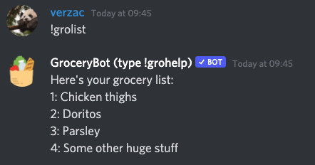

# Getting Started with GroceryBot

Get a grocery list going for your Discord server! No more switching apps just to have a look at your grocery list.

:::info

## Slash Commands Are Now Out!

**From April 2022, message commands (e.g. `!gro`) will be fully replaced by its slash commands counter-part (e.g. `/gro`). All commands have been fully migrated and tested, except `!grobulk`.**

If you want to use the old format (which will be supported indefinitely), please mention `@GroceryBot` in your commands; otherwise, GroceryBot won't receive your commands! For example:


:::

## Getting started

To get started with GroceryBot, all you have to do is add the bot to your server through the link below:

**[Invite GroceryBot](https://discord.com/oauth2/authorize?client_id=815120759680532510&permissions=2048&scope=bot%20applications.commands)**

...and, that's it!

_Note: GroceryBot requires the "Send Message" permission to function (i.e. communicate with you) properly. Please make sure that it is enabled!_

<!--  -->


## !gro - Adding your first grocery entry 📝

<!-- Picture this: you're currently in a Discord convo with your housemates. You're deciding on what to eat, and suddenly, an eureka hits you: a pasta dish would be amazing! You have to buy the ingredients first though. There are now 2 scenarios: you pull out your phone, fiddle around with a grocery list app, switch between that app and Discord multiple times as you telegraph what your housemates want on your pasta to your app; or...

...you just use GroceryBot and tell your housemates to add their desired ingredients themselves. Oh, and don't forget the snacks! -->

Once you add GroceryBot, you can immediately start adding grocery entries to your list through `!gro <item name>`:

```
!gro Chicken thighs
```


## !grolist - Displaying/viewing your grocery list 👓

Alright, so everyone's added their preferred pasta topping and some sides as well - great!

To bring up your grocery list:

```
!grolist
```

```
Here's what you have for your grocery list:
1. Chicken thighs
2. Doritos
3. Parsley
4. Some other huge stuff
```



## !grohere - Attaching a self-updating grocery list to a channel 📲

You can also use the following command to "attach" a self-updating message for your grocery list:

```
!grohere
```


As you update your grocery list, GroceryBot will update this message, so you don't have to keep typing `!grolist` all the time!

_Protip: attach it to the channel, or have a dedicated channel just for that message - it'll make your life so much easier as you only need to switch channels to view your latest grocery list._

## !groremove - Removing grocery entries 🧹

Okay, okay - Kyle probably didn't need you to buy Doritos as well; you're just a lone shopper, after all! You can't buy everything for the house yourself.

Removing grocery entries is easy as well through `!groremove <item name>` or `!groremove <item index>`:

```
Here's what you have for your grocery list:
1. Chicken thighs
2. Doritos
3. Parsley
4. Some other huge stuff
```


`!groremove 2` or `!groremove doritos` will remove "Doritos" from your grocery list.

## !groedit - Changing things ✏️

Ah crap, you didn't mean to say "Chicken thighs"; you meant to say "Chicken breast".

To edit your grocery list, use `!groedit <item index> <new name>`:

```
Here's what you have for your grocery list:
1. Chicken thighs
2. Parsley
3. Some other huge stuff
```

```
!groedit 1 Chicken breast
```

```
Updated item #1 on your grocery list to Chicken breast
```


## !grobulk - Adding multiple items 📝 📝 📝

Have a grocery list in mind? Let's add all of them to GroceryBot!

To add multiple items, use `!grobulk` with each item being on a new line:

```
!grobulk
Cheese
Fettucine
Bolognese sauce
```


## !groclear - Clearing your grocery list 🧹

Great - you're done with your groceries!

To clear your current grocery list, use `!groclear`:

```
!groclear
```


## !grohelp - Get help! 👨🏻‍⚕️

Can't remember all of these? Don't worry, just use `!grohelp` to get this in a nice, concise format:

```
!grohelp
```

## ...and, that's it! ✅

Congratulations, you're now a certified GroceryBot professional! 🎉

We have more advanced documentation for GroceryBot which you can view below:

- [Privacy policy (and how to remove your data)](/privacy-policy)
- [Using multiple grocery lists](./multilist.md)
