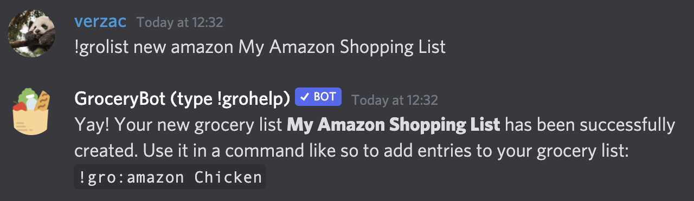
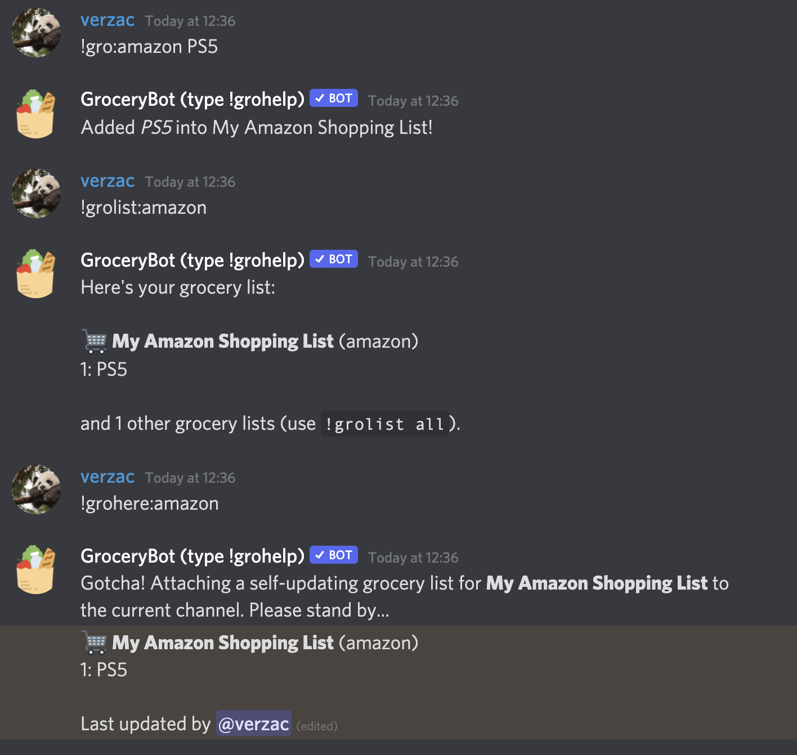
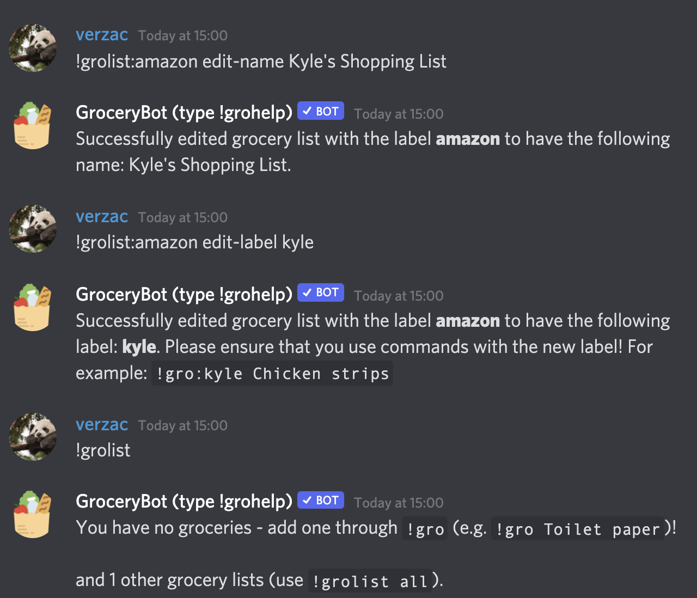

# Multiple Grocery Lists

Maintaining a single grocery list for your server is good and all, but if you've been enthusiastically using GroceryBot, you may want to start using it to maintain your other lists.

GroceryBot allows you to make multiple grocery lists (since late 2021), so that you can have a main grocery list and have separate grocery lists for your other, not-so-essential items, such as items that is only purchasable from your local Sunday Market. It's also great if you want to maintain other list-y things such as wishlists.

ALL of GroceryBot's commands support multiple grocery lists.

## TL:DR;

**Making a new grocery list**

```
!grolist new <your-new-list-label> <optional - a pretty name for your list>
!grolist new amazon My Amazon Shopping List
```

**Using that new grocery list**

```
<command>:<your-new-list-label>

!gro:amazon A brand new PS5
!gro:sunday-market Chicken fillet
!grolist:sunday-market
!groremove:sunday-market Chicken fillet
!grohere:sunday-market

...and a bunch of other commands following the same format above
```

## Making a new grocery list

In order to make a new grocery list, use `!grolist new <your-new-list-label> <optional - a pretty name for your list>`:

```
!grolist new amazon My Amazon Shopping List
```



## Using your new grocery list

Alrighty, so you've made a new grocery list - sweet!

To access your grocery list, you can use the following format: `<command>:<your-new-list-label>`

For example:

```
!gro:amazon PS5
!grolist:amazon
!grohere:amazon
```

Slash command counterpart:

```
/grolist new label:amazon pretty-name PS5
```



## Editing/deleting your new grocery list

Oops, did you name your grocery list wrong? That's okay!

To edit your grocery list's name/label, use the following commands:

```
!grolist:amazon edit-label ebay
!grolist:amazon edit-name Kyle's Amazon Shopping List
```


