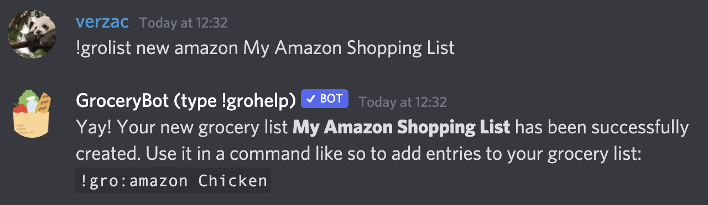
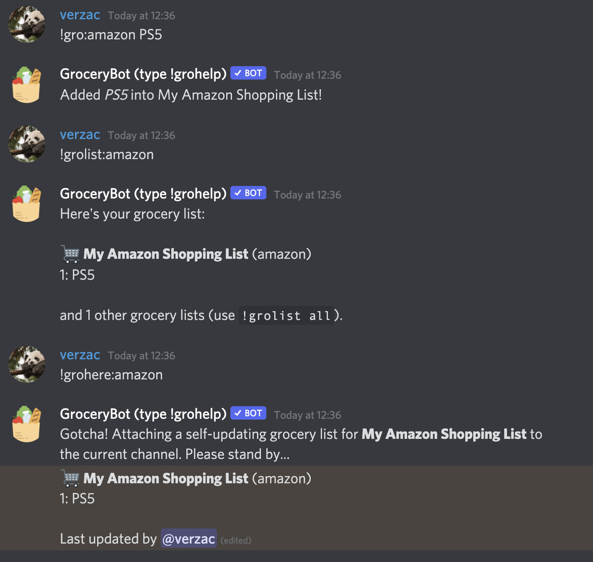
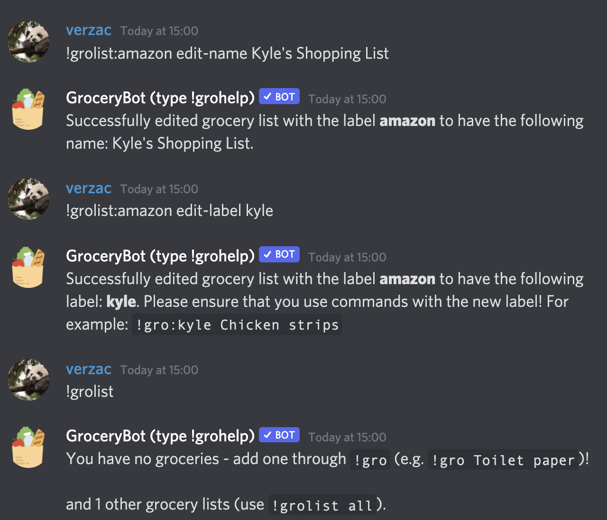

# Multiple Grocery Lists

Maintaining a single grocery list for your server is good and all, but if you've been enthusiastically using GroceryBot, you may want to start using it to maintain your other lists.

GroceryBot allows you to make multiple grocery lists (since late 2021), so that you can have a main grocery list and have separate grocery lists for your other, not-so-essential items, such as items that is only purchasable from your local Sunday Market. It's also great if you want to maintain other list-y things such as wishlists.

Most GroceryBot slash commands support multiple grocery lists through the optional `list-label` field.

## TL:DR;

**Making a new grocery list**

```
/grolist-new label:amazon pretty-name:"My Amazon Shopping List"
```

**Using that new grocery list**

```
/gro entry:"A brand new PS5" list-label:amazon
/gro entry:"Chicken fillet" list-label:sunday-market
/grolist list-label:sunday-market
/groremove entry:"Chicken fillet" list-label:sunday-market
/grohere list-label:sunday-market
```

## Making a new grocery list

In order to make a new grocery list, use `/grolist-new`:

```
/grolist-new label:amazon pretty-name:"My Amazon Shopping List"
```



## Using your new grocery list

Alrighty, so you've made a new grocery list - sweet!

To access a custom list with slash commands, use the command's `list-label` option.

For example:

```
/gro entry:"PS5" list-label:amazon
/grolist list-label:amazon
/grohere list-label:amazon
/groclear list-label:amazon
/groedit entry-index:1 new-name:"PS5 Slim" list-label:amazon
/groremove entry:1 list-label:amazon
```



## Editing/deleting your new grocery list

Oops, did you name your grocery list wrong? That's okay!

To delete a grocery list, use:

```
/grolist-delete list-label:amazon
```



For now, renaming list labels and list display names (`edit-label` / `edit-name`) is only available through legacy message commands. See [Legacy Message Commands](./legacy/message-commands.md) for that syntax.
